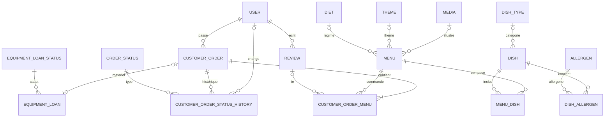

# _DEV_DATA_MODEL

Modele relationnel cible fusionne depuis l'ancien MCD et le document de relations.

## Conventions

- Nommage SQL aligne sur Doctrine en `snake_case`
- Cle primaire standard: `id`
- Cle etrangere standard: `<propriete>_id`
- Nullabilite pilotee par les mappings Doctrine

## Diagramme

## Relations clefs

### Utilisateurs

- `user` 1..N `customer_order`
- `user` 1..N `review`
- `user` 0..N `customer_order_status_history` via `changed_by_user_id`

### Catalogue

- `menu` 0..N lie a `theme`, `diet` et `media`
- `menu` 1..N `menu_dish`
- `dish` 0..N lie a `dish_type`
- `dish` 1..N `dish_allergen`

### Commandes

- `customer_order` 1..N `customer_order_menu`
- `customer_order` 1..N `customer_order_status_history`
- `customer_order` 0..1 `equipment_loan`
- `order_status` 1..N `customer_order_status_history`
- `equipment_loan_status` 1..N `equipment_loan`
- `review` 0..N `customer_order_menu`

### Tables autonomes

- `opening_hour`
- `contact_message`

## Points d'integrite

- `customer_order_menu` porte la ligne de commande: quantite, prix unitaire, `review_id` optionnel
- `menu_dish` et `dish_allergen` sont des tables de liaison many-to-many
- La relation `customer_order` <-> `equipment_loan` implique une contrainte `UNIQUE` cote commande
- Des index ou contraintes composites peuvent etre utiles sur les tables de liaison selon les usages

## Entites principales

- `User`: comptes, roles et donnees personnelles
- `Menu`: offre vendue, stock, theme, regime, conditions, media
- `Dish`: entree / plat / dessert et allergenes
- `CustomerOrder`: commande client, livraison, suivi des statuts
- `Review`: note, commentaire et validation
