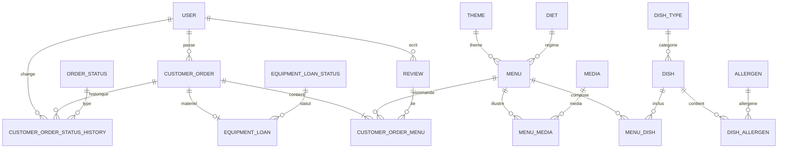

# MCD - Vite & Gourmand

## Vue d'ensemble
Ce MCD decrit le modele cible de la base relationnelle. Les noms sont alignes sur les conventions de Doctrine (snake_case en base).

## Diagramme (Mermaid)

## Regles de modelisation
- `customer_order_menu` est la table associative entre `customer_order` et `menu` (quantite, prix unitaire, review_id optionnel).
- `menu_dish` et `dish_allergen` sont des tables de liaison many-to-many.
- `customer_order` peut lier 0 ou 1 `equipment_loan` (contrainte d'unicite cote commande).
- `opening_hour` et `contact_message` sont des tables autonomes (pas de relation directe).

## Entites principales (indicatif)
- User : comptes, roles, infos personnelles.
- Menu : titre, description, theme, regime, min personnes, prix, stock, conditions.
- Dish : entree/plat/dessert, allergenes.
- CustomerOrder : commande client, adresse, livraison, statuts.
- Review : note 1-5, commentaire, validation.
